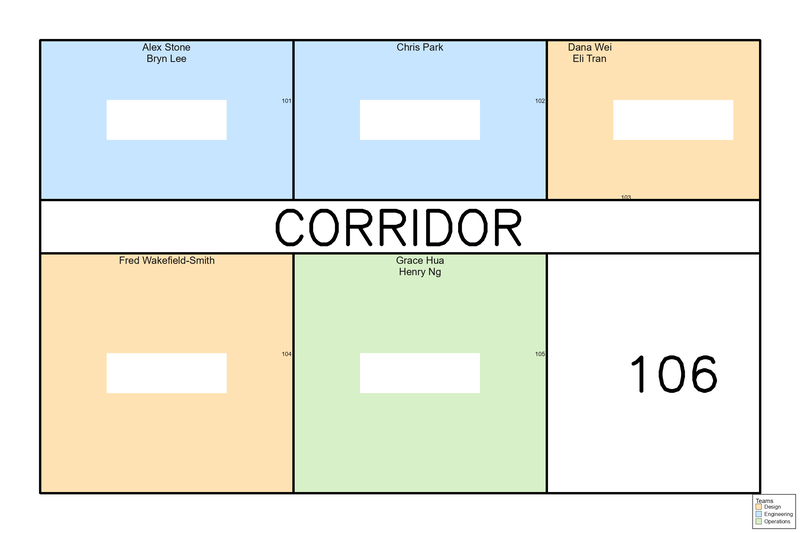
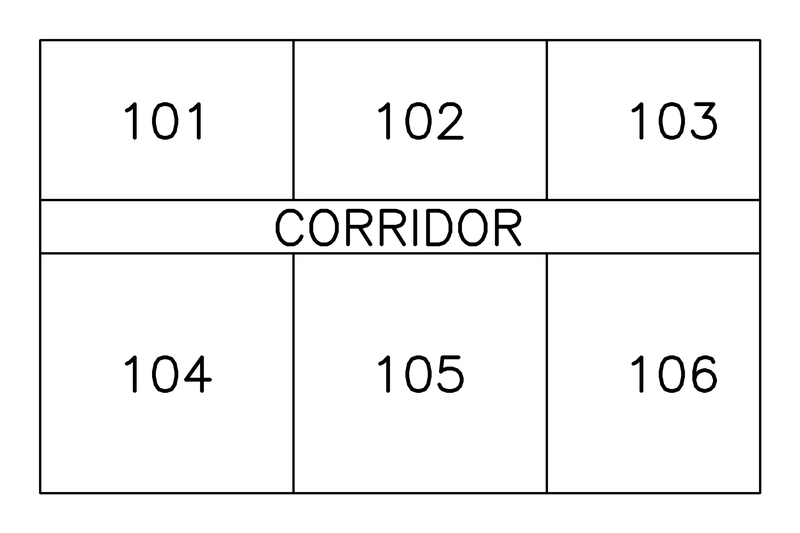
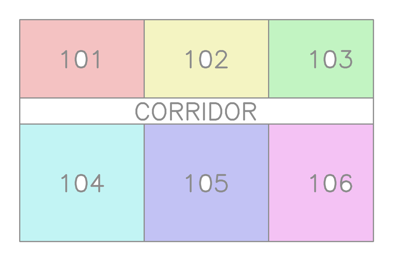
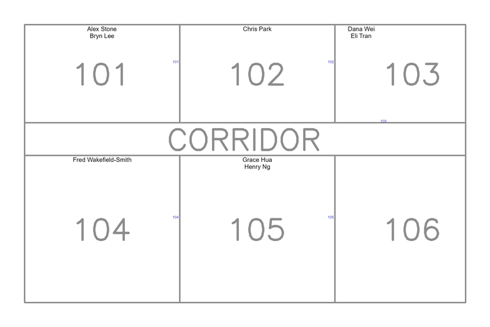
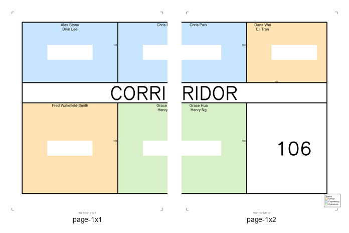

# OfficeMapMaker

Build a colored, labelled office floor map from a floor-plan image plus a
spreadsheet of people → offices → teams. Output a full-resolution composite,
letter-size print tiles, and a single printable PDF.



## What it does

- Reads a floor-plan image (PNG) and an assignments file (`.xlsx`, `.xls`, or `.csv`)
- Color-fills each assigned office with its team's color (auto-palette, WCAG-AAA contrast)
- Writes each person's name inside their office, fitting and abbreviating as needed
- Preserves and relocates the original office number so it stays visible
- Leaves vacant offices, hallways, and common areas exactly as they appear in the source map
- Tiles the result into letter-size pages for printing and stitching, plus a multi-page PDF
- **Refuses to produce a stale render**: every pass is gated on human review of a generated artifact, and on SHA-matching of inputs

## Quick reference: what to run

| When you want to… | Run |
|---|---|
| Set up calibration for a new map (one time per map) | `OfficeMapMaker calibrate --map MAP.png` |
| Open the calibration review PDF (auto-rebuilds if you edited the calibration) | `OfficeMapMaker calibrate review --calibration calibration.json` |
| Confirm calibration is correct | `OfficeMapMaker calibrate confirm --calibration calibration.json` |
| Check assignments match the map | `OfficeMapMaker validate labels --calibration calibration.json --assignments PEOPLE` |
| Find flood-fill leaks | `OfficeMapMaker validate fill --map MAP.png --calibration calibration.json` |
| Plan name placement | `OfficeMapMaker layout --map MAP.png --calibration calibration.json --assignments PEOPLE` |
| Confirm layout is correct | `OfficeMapMaker layout confirm --layout layout.json` |
| Render the composite | `OfficeMapMaker build --map MAP.png --calibration calibration.json --assignments PEOPLE --layout layout.json` |
| Confirm composite is correct | `OfficeMapMaker build confirm --composite composite.png` |
| Tile + PDF for print | `OfficeMapMaker tile --composite composite.png --out tiles\` |

Common flags on every subcommand: `--auto` (skip review gates) and `--force`
(ignore stale-input SHA mismatches).

## Installation

1. Install Python 3.9 or newer (already present on most Microsoft dev boxes).
2. Install Tesseract OCR for Windows from the UB Mannheim build:
   <https://github.com/UB-Mannheim/tesseract/wiki>. Add its install dir to `PATH`,
   or set `TESSERACT_PATH` to point at `tesseract.exe`.
3. From `OfficeMapMaker\`:
   ```
   py -m pip install -r requirements.txt
   ```

The `OfficeMapMaker.cmd` wrapper in this folder forwards arguments to
`py -m officemapmaker`, so you can launch the tool the same way as the other
DevTools utilities.

## Try the included Demo

`samples\Demo\` ships with a six-office synthetic floor plan, an 8-person
`assignments.csv`, a `teams.json`, and a hand-vetted `calibration.json` so
you can walk the whole pipeline (skipping the `calibrate` step) without
needing your own map:

```
cd samples\Demo
OfficeMapMaker validate labels --calibration calibration.json --assignments assignments.csv
OfficeMapMaker validate fill   --map map.png --calibration calibration.json
OfficeMapMaker layout          --map map.png --calibration calibration.json --assignments assignments.csv
OfficeMapMaker layout confirm  --layout layout.json
OfficeMapMaker build           --map map.png --calibration calibration.json --assignments assignments.csv --layout layout.json --teams teams.json
OfficeMapMaker build confirm   --composite composite.png
OfficeMapMaker tile            --composite composite.png --out tiles
```

Each screenshot in this README was generated from that sample.

## The end-to-end workflow

The tool runs as six passes. Each pass produces a **review artifact** (image or PDF) that
you eyeball before confirming the result. The next pass refuses to run until the previous
one's `.reviewed` sentinel exists and its inputs still match.

That sounds heavy, but it pays off the first time you catch a misclassified hallway or
a fill leak before sending the printed map to your team.

### Step 1 — Calibrate the map (one time per floor plan)

```
OfficeMapMaker calibrate --map MAP.png
```

**Source map** (the only required input besides the spreadsheet):



**What happens:** OCR finds every numeric/alphanumeric label, connected-components
detects every room, the tool associates labels to rooms and auto-classifies each as
`office`, `hallway`, or `common`. Writes `calibration.json` next to the map.

The detected rooms are written to `calibration_rooms_overview.png` in distinct
alternating colors so you can scan for merged-room patterns at a glance:



**Auto-checks:** every label is inside exactly one room; no room contains two `office`
labels; no duplicate IDs.

**Review:**
```
OfficeMapMaker calibrate review --calibration calibration.json
```
Builds `calibration_review.pdf` (if it doesn't exist yet or you've hand-edited
`calibration.json` since it was last built) and opens it in your default viewer.
It has four pages:
1. Map with every label boxed in green and the OCR-read text shown.
2. Every room polygon outlined in a distinct color with its area + classification. **Look for two rooms that are actually one merged region** — those usually need a `wall_patches` entry.
3. Thumbnail grid of labels sorted by OCR confidence (lowest first). **Scan for misreads.**
4. Orphans: any detected room with no label, or any label outside all rooms.

**Common edits to `calibration.json`:**
- Fix an OCR misread: edit `labels[*].id`.
- Reclassify a hallway label the tool guessed as an office: change `classification` to `hallway`.
- Disambiguate duplicate room numbers (e.g., the `1003` in two wings): change one to `1003-N` and the other to `1003-S`. The spreadsheet must use the same form.
- Plug a flood-fill leak: add `[x1, y1, x2, y2]` to `wall_patches` (you'll be guided to specific endpoints in Step 3).

After any of these edits, run `calibrate review` again — it notices the
calibration is newer than the PDF, rebuilds the PDF, and opens it. Any prior
`calibration.json.reviewed` sentinel is cleared automatically (you'll need to
re-confirm). Don't re-run `calibrate` to pick up your hand-edits — that does a
fresh OCR pass and overwrites them.

**Confirm:**
```
OfficeMapMaker calibrate confirm --calibration calibration.json
```
Writes `calibration.json.reviewed`. Subsequent passes are now allowed to use this calibration.

### Step 2 — Validate labels against your assignments

```
OfficeMapMaker validate labels --calibration calibration.json --assignments people.xlsx
```

**What happens:** every spreadsheet `Office number` is checked against the calibration.
Errors are fatal; warnings are informational.

**Errors (must fix):**
- A person's office isn't on the map.
- A person's office is classified `hallway` or `common`.
- A person's office matches a duplicate (ambiguous) ID.

**Warnings (worth reading):**
- An office on the map has no one assigned (will be left white — that's usually fine).
- A label with low OCR confidence has no spreadsheet match (probable OCR misread, or simply a vacant office).
- Duplicate (Name + Office + Team) rows in the spreadsheet.
- A team name is a near-duplicate of another (`Revenue` vs `revenue`).

**Review:** open `calibration_validation_labels_review.png` to see flagged labels circled in red.
If clusters of errors appear in one wing, you've probably got a systematic problem.

**Fix flow:** edit the spreadsheet or the calibration, then re-run. There is no `confirm` step
for this pass — a clean run is its own confirmation.

### Step 3 — Validate fill (find flood-fill leaks)

```
OfficeMapMaker validate fill --map MAP.png --calibration calibration.json
```

**What happens:** the tool virtual-flood-fills every `office` room from its seed point
against a mask built from the map plus any `wall_patches`. It compares the filled area
to the room polygon and checks that the fill doesn't reach another room's seed.

**Errors (must fix):**
- Filled area is too large (> 3× polygon area, or > 3× median office area).
- One office's fill reaches another office's seed point — the two rooms are connected through a gap.

**Review the leak overlays:** `calibration_leaks\room-<id>-<code>.png` shows the
original map (faded) with the leak in cyan and the involved seed points marked.
The text report suggests two endpoints to add to `wall_patches`. For example:

> Room 1480 leaks into Room 1481. Suggested patch: `[612, 940, 612, 968]`.

Copy that into `calibration.json.wall_patches`, re-run `validate fill`, and repeat
until the report is empty. Also browse `calibration_rooms_overview.png` once — it
colors every room distinctly so you can scan for any merged-room patterns that
survived.

### Step 4 — Plan name layout

```
OfficeMapMaker layout --map MAP.png --calibration calibration.json --assignments people.xlsx
```

**What happens:** for each office, the tool computes the largest inscribed rectangle,
stacks the assigned names, and runs the abbreviation ladder until they fit:
1. Try full names; binary-search font size down to `min_font_pt`.
2. If still too tall, abbreviate first names to initials (`Sravani P.`).
3. If still too tall, use last name only (`Punyamurthula`).
4. If still too tall, render at min size and add a leader line to the nearest margin.

Then picks a corner inside the rectangle for the original office number.
Writes `layout.json`.

**Auto-checks:** every assigned person is placed in exactly one office; no planned text
pixel lands on a wall (non-white pixel of the original map) or outside its room polygon;
the office number is always present.

**Review:** open `layout_review.png` — a faded copy of the original map with the planned
text overlaid in its final positions, no fill yet. Also `layout_review_problems.png`
shows only the rooms that fell back beyond `shrink` (initials, last-only, or leader line) —
worth a quick scan; you may want to hand-edit `layout.json` for some of them.



**Confirm:**
```
OfficeMapMaker layout confirm --layout layout.json
```

### Step 5 — Render the composite

```
OfficeMapMaker build --map MAP.png --calibration calibration.json ^
                     --assignments people.xlsx --layout layout.json
```

**What happens:** auto-generates the team color palette (optionally overridden by
`teams.json`), flood-fills each office, white-outs and redraws the office numbers,
draws the names, and adds the legend overlay in the configured corner.
Writes `composite.png`.


**Auto-checks (the big safety net):**
- Every pixel that changed from the original map lies inside (an office room polygon ∪ planned text bboxes ∪ legend bbox). Any unexpected pixel change is a bug — fail.
- Every team color has ≥ 7:1 contrast vs. black.
- Every office contains its team color somewhere (sanity check).
- Composite resolution equals source resolution.

**Review:** open `composite_review.png` (which is just `composite.png` opened for you).
If it looks right:

```
OfficeMapMaker build confirm --composite composite.png
```

### Step 6 — Tile for print

```
OfficeMapMaker tile --composite composite.png --out tiles\
```

Default is 150 DPI letter portrait with 0.25" overlap. Outputs:
- `tiles\page-RxC.png` — one PNG per page, with footer (`Row R / Col C of nR×nC`) and corner crop marks.
- `tiles\contact_sheet.png` — 4-up grid of all tiles for at-a-glance review.
- `tiles\all.pdf` — all tiles plus a dedicated full-page legend.

**Auto-checks:** every composite pixel appears in ≥ 1 tile; no tile text is below `min_font_pt` at the chosen DPI; tile crops actually match the composite.

A `tiles\contact_sheet.png` is written alongside the per-page PNGs so you can
sanity-check the whole grid at once before printing:



Print the PDF, tape pages together along the overlap, post on the wall, take a victory lap.

> **Future:** an `OfficeMapMaker all` subcommand is planned that will run every
> pass end-to-end. For now, drive the passes one at a time so you walk through
> each review gate explicitly.

## Recipes (common iterations)

### "OCR misread a number"
1. Open `calibration_review.pdf` and find the wrong label on page 3 (lowest confidence first).
2. Edit the `id` field in `calibration.json`.
3. Re-run `calibrate review` — it sees the calibration is newer than the PDF, rebuilds and opens it. Then run `calibrate confirm`.

### "Two rooms are getting merged in flood-fill"
1. Open `calibration_leaks\room-<id>-<code>.png`, find the gap visually.
2. Add the suggested `[x1,y1,x2,y2]` to `wall_patches` in `calibration.json`.
3. Re-run `validate fill`. Repeat until clean.

### "A name falls back to a leader line and I want it inside the room instead"
1. Open `layout_review_problems.png`, find the office.
2. Manually edit `layout.json` to drop one of the names (or use a shorter form).
3. Re-run `layout confirm`.

### "The map image changed"
1. Re-run `calibrate` — the tool detects the new `map_hash` and invalidates all `.reviewed` sentinels.
2. Re-run all subsequent steps.

### "The spreadsheet changed (people moved, but offices are unchanged)"
1. Skip `calibrate` (calibration is still valid).
2. Re-run `validate labels` → `layout` → `layout confirm` → `build` → `build confirm` → `tile`.
   Pass `--auto` to any pass whose prior review gate you trust is still valid
   for the new spreadsheet.

### "I want explicit colors for teams"
1. Create `teams.json` next to your assignments with `{"TeamName": "#RRGGBB", ...}`.
2. Pass `--teams teams.json` to `build`.
3. Any team not listed gets an auto-assigned color. The tool warns if your override fails contrast.

## File formats

### `calibration.json` (per-map; hand-editable)

```jsonc
{
  "map_image": "map.png",
  "map_hash": "sha256:…",
  "labels": [
    {
      "id": "1480",                 // string; supports "1479A", "MER101"
      "bbox": [x, y, w, h],         // original location of the number on the map
      "room_id": 142,               // id of the connected-component room polygon
      "classification": "office",   // office | hallway | common | skip
      "fill_seed": [x, y],          // seed point for flood-fill (defaults to polygon centroid)
      "ocr_confidence": 0.92,
      "notes": ""
    }
  ],
  "rooms": [
    { "id": 142, "polygon_rle": "…", "area_px": 8421, "bbox": [x, y, w, h] }
  ],
  "wall_patches": [
    [x1, y1, x2, y2]                // off-screen mask-only repairs for flood-fill leaks
  ],
  "render_defaults": {
    "min_font_pt": 7,
    "preferred_font": "Segoe UI",
    "tile_dpi": 150,
    "tile_paper": "letter",
    "tile_overlap_in": 0.25,
    "legend_corner": "bottom-right"
  }
}
```

### `teams.json` (optional)

```json
{
  "BITS":    "#C7E5FF",
  "FPAA":    "#FFE2B3",
  "Revenue": "#D7F0C7"
}
```

Any team not listed gets an auto-assigned color from the contrast-safe palette.

### `layout.json` (regenerated each build; hand-editable for tweaks)

Per-office name placement: chosen font size, abbreviation strategy used, name
positions, relocated office-number bbox, leader-line endpoints if any.

## Troubleshooting

| Symptom | Likely cause | Fix |
|---|---|---|
| `Tesseract not found on PATH` | Tesseract not installed | Install UB Mannheim build, set `TESSERACT_PATH` |
| `calibration.json is older than map.png` | Map image changed | Re-run `calibrate` |
| `No .reviewed sentinel for calibration.json` | You haven't confirmed yet | Run `calibrate review` then `calibrate confirm` |
| `Office "1003" is ambiguous (matches 2 labels)` | Duplicate room number across wings | Edit calibration to use `1003-N` / `1003-S`; update spreadsheet to match |
| `Fill leaked from room 1480 into room 1481` | Open doorway in the map | Add the suggested `wall_patches` entry, re-run `validate fill` |
| `Person "Jane Doe" not placed: office 9999 not on map` | Spreadsheet typo or wrong floor | Fix the spreadsheet row, or add the office to calibration if it was missed |
| `... is a password-protected or rights-managed Office document` | Spreadsheet is IRM-protected or encrypted | Open it in Excel and **Save As** an unprotected `.xlsx` or `.csv` before running OfficeMapMaker |
| Composite looks fine but `validate fill` fails | Calibration polygon is itself wrong (two rooms merged in CC) | Add a `wall_patches` entry to split them, re-run `calibrate` (the CC will be recomputed) |
| `Pixel changed outside any expected region` from `build` | Internal bug, or stale calibration | File a bug; in the meantime re-run `calibrate` |

## Glossary

- **Room polygon** — a connected-component region of white pixels in the map's interior; one polygon per enclosed space.
- **CC (connected components)** — OpenCV's algorithm for finding connected regions of like-colored pixels.
- **Fill mask** — the binary image used for flood-fill: original wall pixels OR `wall_patches`. The visible image is never altered by patches.
- **Wall patch** — a 1-pixel dark line segment drawn onto the fill mask (only) to close a gap in a wall.
- **Inscribed rectangle** — the largest axis-aligned rectangle that fits entirely inside a room polygon. Used as the bounding box for names.
- **Review artifact** — the image or PDF generated by a pass for you to eyeball.
- **Sentinel** — a `<file>.reviewed` empty file that records "you confirmed this output is correct". The next pass refuses to run without it (unless `--auto`).
- **Stale-SHA gate** — if any input to a pass has changed since the prior pass was reviewed, the SHA recorded in the manifest won't match, and the next pass refuses to run.
